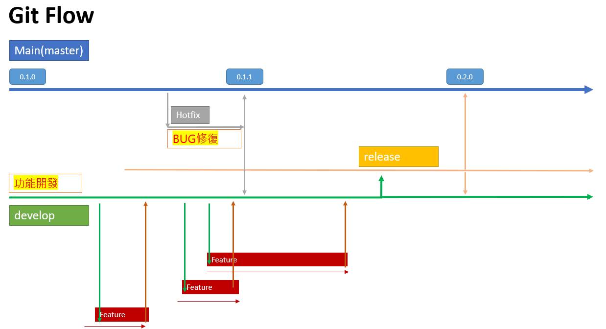
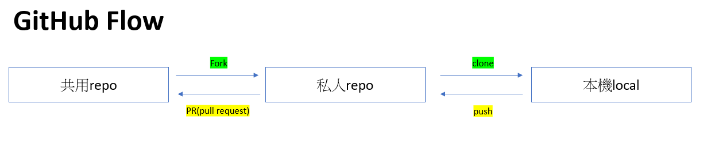
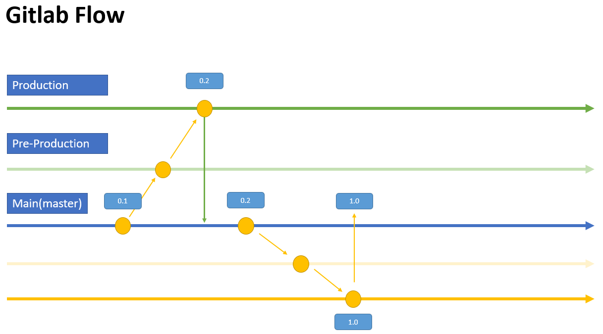

# Git Flow

使用Git做版控，個人學習隨手記

### 為什麼要做版控?

是否待過那種公司?  
後端工程師 (back-end) 在整合前端工程師 (front-end) 的程式的時候  
遇到問題要求前端工程師給予調整樣板之類的問題  

但是前端工程師使用的是交檔給後端工程師之前的專案  
既沒有後端工程師拿到後實作的更改，前端改完給後端，又不知道改了哪裡要加回去的地方  

我的前公司就遇到這種事情，解決辦法竟然是要求前端，一步步用電話說明改了甚麼==🫠  
真的不是很OK鴨~~

所以一般即使兩人的團隊都是要建議使用版控來實作任意專案，我理解大家案子都很趕，但不要以為不用git會更快  
到時候我可以保證兩邊都會很不爽，一個懷疑對方資料沒有給齊全，一個不爽對方懷疑自己寫的有問題  
git保證讓雙方啞口無言，所有更動證據都在那裏了，誰做了沒做了甚麼都一清二楚

#### 版控優勢

1. git可以做到diff，修改前修改後的任意文件都可以找出不同的地方，如:CRUD
2. 使用github可以方便共同作業，輕鬆同步專案階段
3. 有詳細更動歷史紀錄，予返回更動至上版本
4. 提出 issue 讓參予者提問與cc 更動的pull request

### 版控種類

詳細歷史脈絡我再找時間整理，以下為基本的介紹

1. Git Flow
2. GitHub Flow
3. Gitlab Flow

### Git Flow

* master(main)與develop兩個主線，開發功能整合後再 merge 回主線
* Feature 可能為不同人撰寫，整合完整功能後統一merge 在 develop
* master遇到bugfix請建立分之 hotfix，及時修補功能，完成後同時推回主線與develop
* Release為進入master之前的測試版本，該分支測試完刪除
* Release功能分支命名: ``release-\*``
* Feature 功能分支命名: ``feature-\*``
* Hotfix 功能分支命名: ``fixbug-\*``

### GitHub Flow

* 任何master(main)的分支都可以部屬deploy
* 分支命名應具有描述性，e.g. authentication-addon、user-idol-layout
* 每次提交一定要有commit message 解釋提交內容
* PR(pull request)，提出修改建議或是merge 回主要Repo前的檢閱，@去提起誰幫忙檢閱  
可以看到File Change 的部分，每個PR都會有標記 #12345
* 提交PR過程仍可持續修改，並顯示新提交與新回饋
* PR標記 #12345 可以用於issue 用來討論，其中遇到的問題討論與紀錄

### Gitlab Flow

* 上游優先，所謂的上游就是指master主線，任何其他分支叫做發布版本
* 表示所有更動都在master完成後再到pre-product測試，再到product發布
* 所以任何在product 分支上發現的修正都要merge回到上游master後再做修改

### 結語

現在很多公司竟然還都不管作業流程的，git已經成為工程師必要的個人簡介  
先學會管理自己，再去學好程式比起甚麼都重要  
不要再為了節省時間，因為並沒有好嗎?